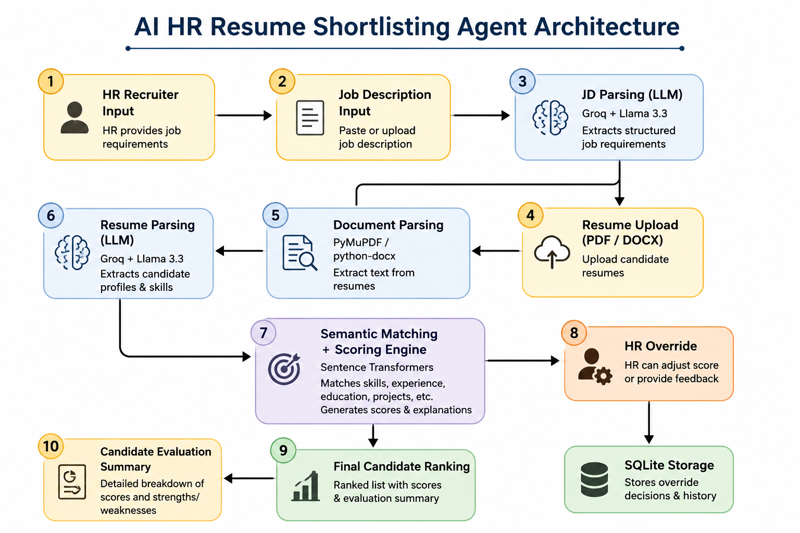

# AI HR Resume Shortlisting Agent

This project is an AI-powered HR screening system built to automate the initial candidate shortlisting process.

The application allows recruiters to upload multiple resumes, paste a job description, and automatically evaluate candidates based on relevant skills, education, experience, projects, and communication quality. It also supports HR override decisions so human judgment remains part of the hiring process.

## What this project does

- Parses resumes from PDF and DOCX files
- Extracts structured candidate details using LLMs
- Parses job descriptions into structured requirements
- Matches candidate skills with job requirements using semantic similarity
- Scores candidates using a weighted evaluation system
- Ranks multiple candidates automatically
- Provides evaluation reasoning for transparency
- Allows HR to override AI-generated scores with justification
- Stores override decisions in SQLite for tracking
- Includes basic prompt sanitization for safer LLM usage

---

## Scoring Criteria

Candidates are evaluated using the following weights:

| Parameter | Weight |
|---------|--------|
| Skills Match | 30% |
| Experience | 25% |
| Education | 15% |
| Projects | 20% |
| Communication | 10% |

---

## Tech Stack

**Frontend**
- Streamlit

**Backend**
- Python

**LLM / NLP**
- Groq API
- LangChain
- Llama 3.3
- Sentence Transformers

**Database**
- SQLite

**Resume Parsing**
- PyMuPDF
- python-docx

---
## System Architecture




## Project Structure

```bash
ai_hr_shortlisting_agent/
│
├── agents/
│   ├── resume_parser.py
│   ├── jd_parser.py
│   ├── scoring_agent.py
│   └── override_agent.py
│
├── utils/
│   ├── pdf_parser.py
│   ├── docx_parser.py
│   ├── security.py
│   └── db.py
│
├── models/
├── data/
├── app.py
├── requirements.txt
├── .env.example
└── README.md
```

---

## Setup Instructions

### 1. Clone the repository

```bash
git clone <your-github-repo-link>
cd ai_hr_shortlisting_agent
```

### 2. Create virtual environment

```bash
python3 -m venv venv
source venv/bin/activate
```

### 3. Install dependencies

```bash
pip install -r requirements.txt
```

### 4. Add environment variables

Create a `.env` file:

```env
GROQ_API_KEY=your_api_key_here
```

### 5. Run the application

```bash
streamlit run app.py
```

---

## Example Workflow

1. Paste the job description
2. Upload one or more resumes
3. System parses job requirements
4. Candidate profiles are extracted
5. Candidates are scored and ranked
6. HR can review explanations
7. HR can override scores if needed

---

## Security Considerations

This project includes some basic security handling:

- API keys stored using `.env`
- `.gitignore` used to prevent secret exposure
- prompt sanitization to reduce unsafe LLM inputs
- simple validation before processing candidate/job text

---

## Future Improvements

Some possible extensions:

- downloadable PDF shortlist reports
- email notifications
- interview scheduling integration
- LinkedIn profile enrichment
- ATS integration
- admin login/dashboard

---

## Author

**Richa Bhawna**